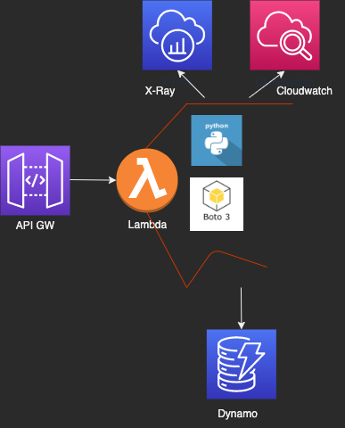

## Solution Overview

The proposed solution is to deploy a three layer serverless application in AWS.

Stack components:

- API Gateway to route the API.
- Lambda as the compute engine.
- DynamoDB as Database.

## High level architecture



## Technology choices

### Compute engine

`Choice: Lambda function`

- Scales up and down to 0 effortlessly.
- Easy to deploy to different environments.
- Good integration in the AWS ecosystem with minimal configuration.
- From the options considered is the one that requires less configuration.
- Abstracted from the infrastructure details like AZs, VPCs, etc.

**Options:**

ECS or EKS all of them with the option to use Fargate to minimize infrastructure management.
Making the App resilient to AWS problems requires more effort.

### API Routing layer

`Choice: AWS API GW`

API gateway is used as the routing layer in front of the API.
Automates the management of the API.
Things like documentation, throttling, api keys are native features of API GW.

**Options:**

Flask API could be beneficial to run the same API in other platforms without API GW on front.
Can also be shipped with lambda in this case is redundant for the functionality needed.

### Database

`Choice: DynamoDB`

Options:

RDS (Aurora):
More difficult scalability and requires more configuration to make it highly available and resilient. 
App don't need transactions or complex queries.

### Observability

`Choice: AWS Tools (Cloudwatch, X-ray)`

- CloudWatch: for logs and metrics.
- X-Ray: for traces of the application.

Note: Observability data like traces, metrics and logs are essential in serverless applications where the visibility at the container level is reduced.

Options:

All other options that come to mind require setting subscriptions or deploying additional infrastructure.

## Design:

### Lambda:

The function should be easily extendable to add functionality.
A single function to get the current epoch and write it to Dynamo

Minimal example:

```Python
import datetime
import boto3
import uuid


def epocher():
	dynamodb = boto3.resource('dynamodb', endpoint_url=DYNAMO_ENDPOINT)
	epoch_object = {
	    current_epoch: seconds_since_epoch = datetime.datetime.now().timestamp()
    ip = x_forwarded_for
	}
    epochs_table = dyanodb.Table('epochs')
    epochs_table.put_item(Item=epoch_object)
```

### API Gateway: 

- Single method: /epoch
- HTTP Method: POST
- API Key: Authentication to the api_endpoint 
- Stages: 
	dev -> Lambda dev 
	prod -> Lambda prod

### Dynamo db table

```json
{
	"key": "uuid generated in the APP",
	"epoch": "curernt_epoch",
	"ip": "this.ip ip calling the API"

}
```

## Pipeline

### Architecture

![CICD]Development tools and technology choices:

#### CICD Platform

`Choice: Github / Github Actions`

- Familiarity and speed of implementation.
- All the functionality needed for the pipelines is present on GitHub actions.

#### Formatters

- python: black
- terrafrom: terraform fmt

#### Linters

- pylint,
- tflint

#### Checkers

- tfsec,
- git_guardian

#### Tests

- Python scripts possibly pytest
